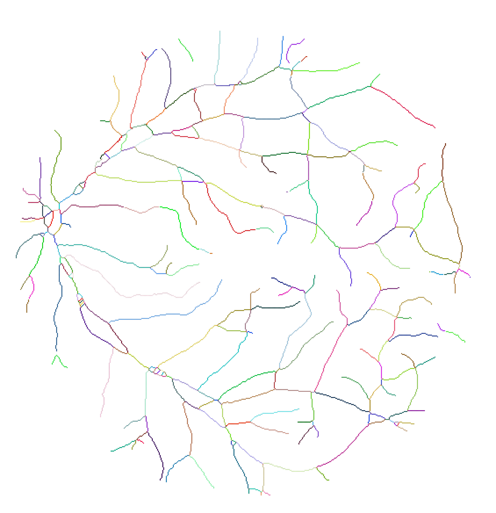
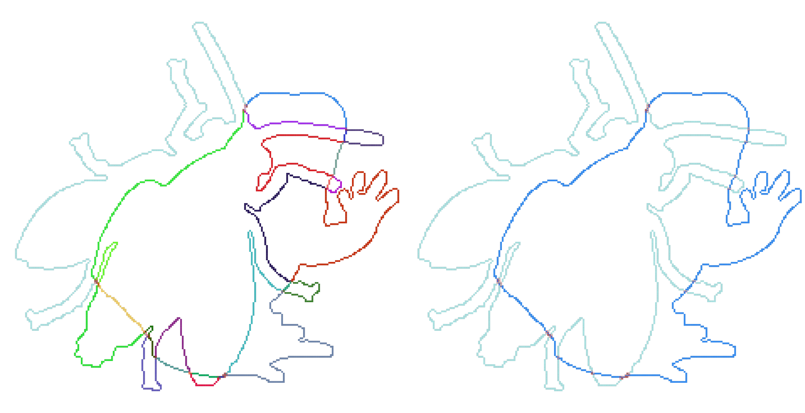

# General Ambiguity Model for Binary Edge Images with Edge Tracing

## Overview

This repository contains the C++ implementation of our general ambiguity model for binary edge images with edge tracing. The model is designed to identify and resolve ambiguities as a result of intersections, junctions, and other structures. The objective is to provide a versatile and intuitive preprocessing method for tasks such as figure-ground segmentation, object recognition, topological analysis, etc.

Further details can be found in our [paper](https://arxiv.org/abs/xxxx.xxxxx). If you use the model in your research, please cite it:

```bibtex
@misc{arxiv:xxxx.xxxxx,
  author = {Markus Hennig and Marc Leineke and B{\"a}rbel Mertsching},
  title = {A General Ambiguity Model for Binary Edge Images with Edge Tracing and its Implementation},
  doi = {10.48550/xxxx.xxxxx},
  url = {https://arxiv.org/abs/xxxx.xxxxx},
  publisher = {arXiv},
  year = {2024}
}
```

**Note**: The DOI/arXiv link will be updated upon publication, which is expected in the next few days.

### Modeling Concept and Examples

In our model, ambiguities are pixels where the paths of edges are not clearly defined. In the following examples, ambiguities are marked with a red border, and the small circles indicate start and endpoints of edges, respectively. The main idea is that all edges associated with the same ambiguity are effectively linked. The top-left examples do not contain any ambiguities, so the edges are simply traced. The ambiguities in the bottom-right examples each form a single, coherent ambiguity.


The following example shows the model output for a [binarized retina image](testimages/additional/retina-large.png). The model provides a detailed breakdown into edges and captures which edges are connected at ambiguities.



[View PDF version](docs/images/retina-large-out.pdf)

### Application Example: Resolving Ambiguities

The following example shows [two stacked contours](testimages/paper/frogfly.png), leading to complex ambiguities (left image). Based on the model output, these contours can be completely separated using some simple modular postprocessing steps (right image). This and further examples together with the corresponding postprocessing commands are described in [examples-with-code.md](docs/examples-with-code.md).



[View PDF version](docs/images/frogfly-out-post.pdf)

## Installation and Usage

### Requirements

- C++17
- OpenCV 4 (tested with version 4.5)
  
### Build

Go into the base directory and run the following commands:

```sh
mkdir build
cd build
cmake ..
make
```

### Usage

Go into the base directory and run the following command:

```sh
./build/tracing <input image>
```

For example:

```sh
./build/tracing testimages/paper/phi.png
```

The input image should be a binary edge image with pixel values of 0 (black) and 255 (white), preferably in PNG format to avoid compression artifacts.
Some test images are in the folder [testimages](testimages).

### Output

Visualizations of the results will be saved in the folder [output](output).

- `tracedEdges.svg`: Overall result with the identified ambiguities and traced edges.
- `edgeIdMap.svg`: A visualization of the *edgeIdMap*, where each color corresponds to a different *edgeId*.

Visualizations can be written at any step (such as before and after postprocessing). Use an SVG editor such as [Inkscape](https://inkscape.org/) to zoom into details. Activate the flags at the top of `Visualizer.cpp` to enable writing the *edgeIds* and other information to the SVG.
