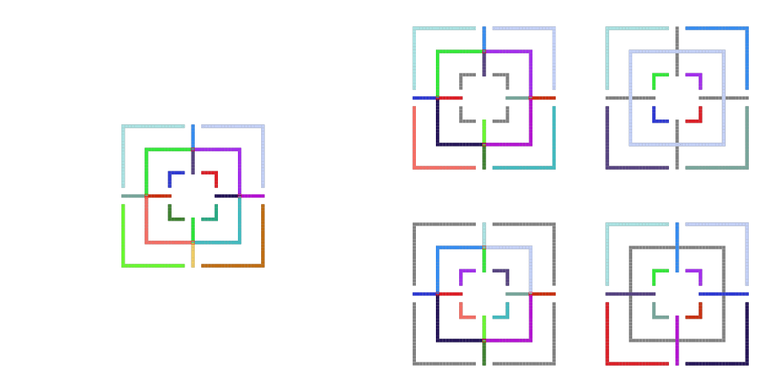
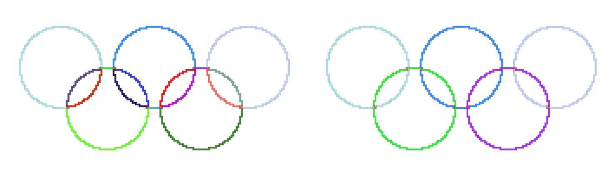
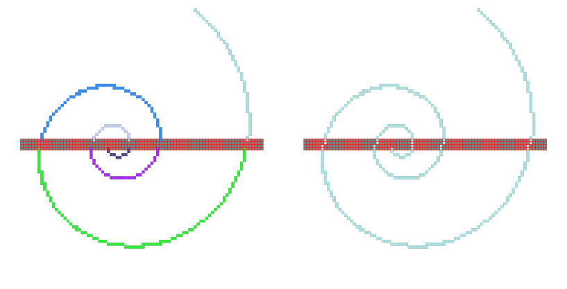
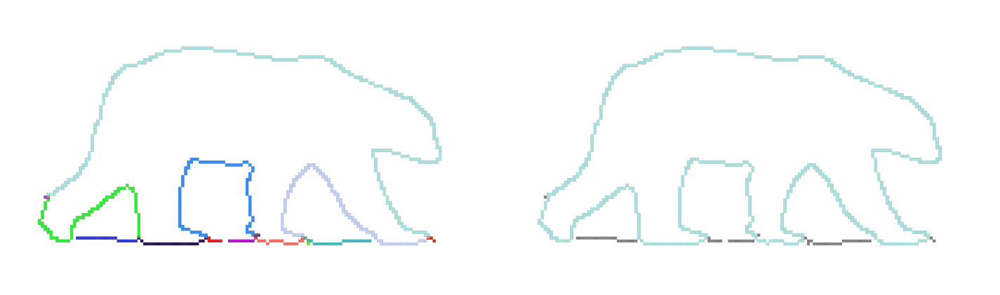
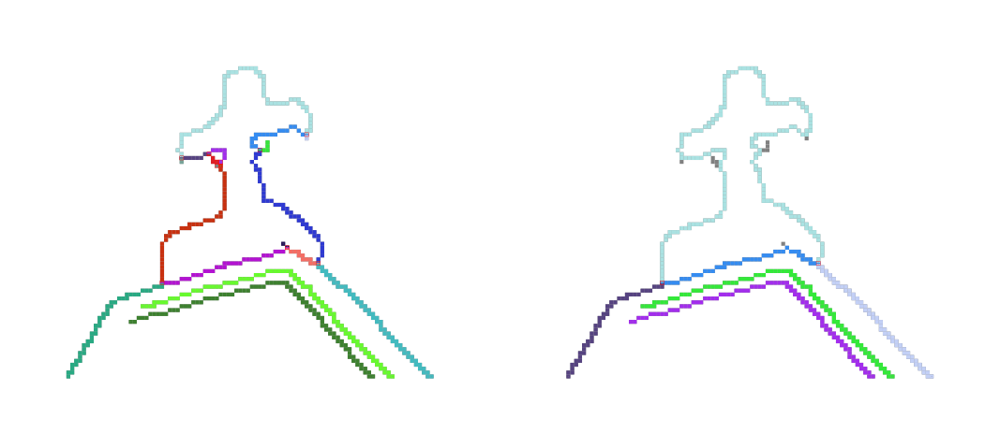
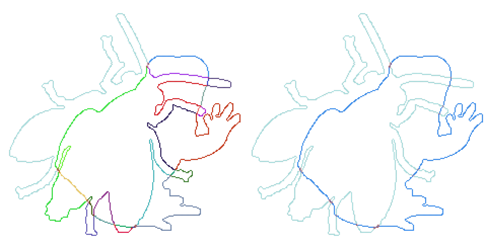
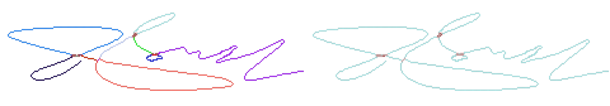
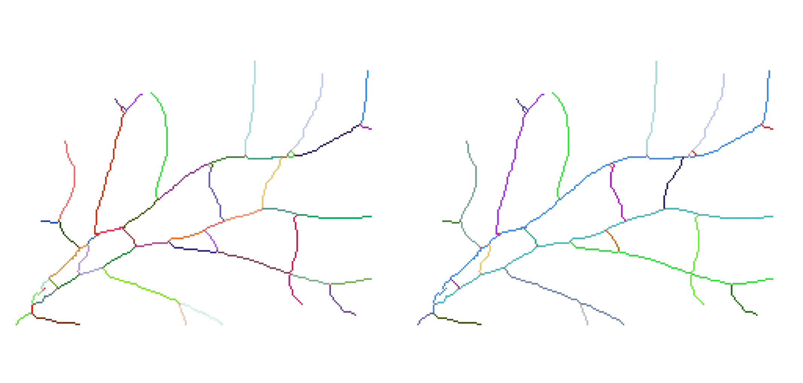

# Examples with Code

## Running the Method

Running the method is straightforward, as shown in the file [tracing.cpp](./../src/tracing.cpp). Simply create an `EdgeProcessor` object and call the `traceEdges` function, passing the binary edge image `img` that should be processed.

```cpp
EdgeProcessor edgeProcessor;
edgeProcessor.traceEdges(img);
```

After that, and after each optional additional step, the current status can be printed using:

```cpp
edgeProcessor.printEdgeInfos(img);
```

The traced `edges` and the `edgeMap` can be accessed using:

```cpp
// Get read-only references to edges and edgeIdMap
const Edges &edges = edgeProcessor.getEdges();
const EdgeMap &edgeMap = edgeProcessor.getEdgeIdMap();
```

## Postprocessing Examples

The following examples show the initial model output (left) and the results after postprocessing (right). The corresponding commands are provided below each example. The terms "clusters" and "ambiguities" are used interchangeably (including single-pixel ambiguities). Gray pixels after postprocessing indicate pixels that have been removed.

### Example 1: [mill.png](./../testimages/paper/mill.png)



[View PDF version](./../docs/images/mill-out-post.pdf)

```cpp
// Postprocessing code

// Function signature:
// bool removeEdgesLongerThan(size_t numberPixels, bool free=true, bool dangling=true, bool bridged=false);

// Top left
edgeProcessor.removeEdgesShorterThan(20, true, false, false);

// Bottom left
edgeProcessor.removeEdgesLongerThan(10, true, false, false);

// Top right
edgeProcessor.removeEdgesLongerThan(1, false, true, false);

// Bottom right
edgeProcessor.removeEdgesLongerThan(1, false, false, true);
```

### Example 2: [rings.png](./../testimages/paper/rings.png)



[View PDF version](./../docs/images/rings-out-post.pdf)

```cpp
// Postprocessing code

// Function signature:
// void connectEdgesInClusters(size_t numberPixels, double thresholdAngle, double alpha=1.0, double beta=1.0, bool connectSameEdge=true);

edgeProcessor.connectEdgesInClusters(5, 40.0);
```

### Example 3: [spiral.png](./../testimages/paper/spiral.png)



[View PDF version](./../docs/images/spiral-out-post.pdf)

```cpp
// Postprocessing code
edgeProcessor.connectEdgesInClusters(5, 80.0, 1.0, 15.0);
```

### Example 4: [bear.png](./../testimages/paper/bear.png)



[View PDF version](./../docs/images/bear-out-post.pdf)

```cpp
// Postprocessing code
edgeProcessor.removeEdgesShorterThan(30);
edgeProcessor.removeEdgesShorterThan(30);
```

### Example 5: [church.png](./../testimages/paper/church.png)



[View PDF version](./../docs/images/church-out-post.pdf)

```cpp
// Postprocessing code
edgeProcessor.removeEdgesShorterThan(6, true, true, true);
```

### Example 6: [frogfly.png](./../testimages/paper/frogfly.png)



[View PDF version](./../docs/images/frogfly-out-post.pdf)

```cpp
// Postprocessing code
edgeProcessor.threePointEdgesToClusters();
edgeProcessor.connectEdgesInClusters(5, 40.0);
```

### Example 7: [signature.png](./../testimages/paper/signature.png)



[View PDF version](./../docs/images/signature-out-post.pdf)

```cpp
// Postprocessing code
edgeProcessor.threePointEdgesToClusters();
edgeProcessor.connectEdgesInClusters(5, 60.0);
edgeProcessor.reverseAllEdges();
```

### Example 8: [retina.png](./../testimages/paper/retina.png)



[View PDF version](./../docs/images/retina-out-post.pdf)

```cpp
// Postprocessing code
edgeProcessor.removeEdgesShorterThan(3);
edgeProcessor.connectEdgesInClusters(5, 50.0, 1.0, 0.0);
```

